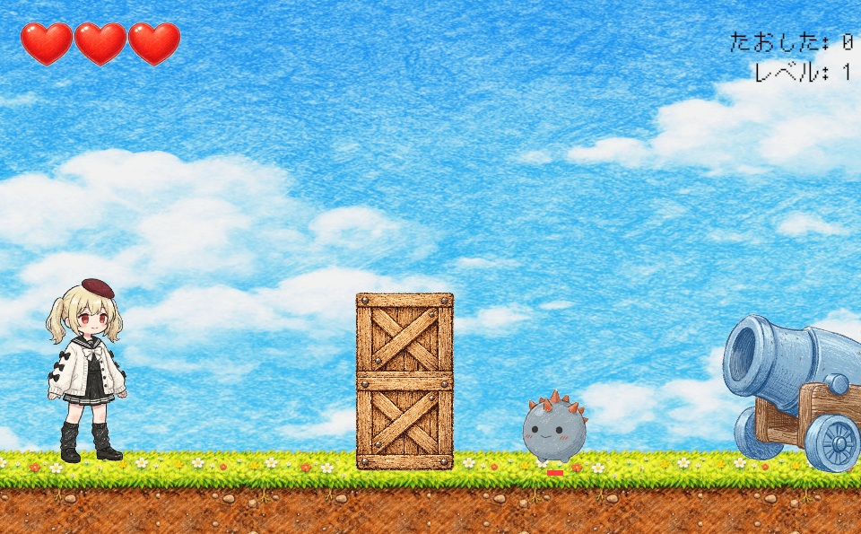

# R3_Sample_01

Unity + R3 でリアクティブにゲームロジックを組んでみるためのサンプルプロジェクトです。  [こちらの記事]()で用いているサンプルコードやサンプルゲームが含まれています。

## 環境

- Unity 6000.3.9f1

## 使用パッケージ

- Universal Render Pipeline
- Input System
- R3
- UniTask
- NuGetForUnity

## プロジェクト構成

- `Assets/R3Samples/Introduction/CreateObservables`
  - R3 で Observable を作る小さめのサンプル
- `Assets/R3Samples/Introduction/SampleGame`
  - 2D サンプルゲーム本体
- `Assets/R3Samples/Introduction/SampleGame/Scripts/Tests`
  - サンプルゲームで用いたコマンド入力判定のテスト

- `Assets/R3Samples/Introduction/SampleGame/SampleGameScene.unity`
  - サンプルゲームのシーンファイル

## サンプルゲームについて

### デモで遊ぶ

以下のリンクより実際のビルドで遊ぶことができます。

- [デモビルド](https://torisoup.github.io/R3_sample_01/)

### サンプルゲーム概要

このプロジェクトは、[R3](https://github.com/Cysharp/R3) を使って Unity 上の入力、状態管理、UI 更新、ゲーム進行をリアクティブに扱うサンプルです。

収録しているサンプルゲームでは、以下のような構成を試しています。

- `ReactiveProperty` を使ったスコア、レベル、ゲームオーバー状態の管理
- プレイヤー入力のストリーム化
- コマンド入力判定
- 非同期処理と `UniTask` によるゲーム進行制御
- R3 ベースでの UI / プレイヤー / 敵の連携

### 操作方法

- 移動: `WASD` / `矢印キー` / ゲームパッド左スティック
- ジャンプ: `Space` / ゲームパッド `South Button`
- 攻撃: `Z` / ゲームパッド `West Button`
- ゲームオーバー後の再開: `Jump` または `Attack`

コマンド入力の例:

- 火炎球発射: `↓ ↘ → + 攻撃`
- アッパーパンチ: `→ ↓ ↘ + 攻撃`
- スピンアタック: `← ↙ ↓ ↘ → + 攻撃`

## LICENSE

`Assets/R3Samples` 以下の C# コードは、明記がない限り [CC0 1.0 Universal](https://creativecommons.org/publicdomain/zero/1.0/deed.ja) とします。  
これは、可能な限り著作権を放棄し、改変、再配布、商用利用などを含めて広く利用できるようにするものです。  
ただし、このプロジェクトの利用により発生した問題について作者は責任を負いません。

コード以外のアセット、パッケージ、フォント、効果音などは、それぞれのライセンスや利用規約に従ってください。
第三者ライブラリおよびアセットの権利表記は [THIRD_PARTY_NOTICES.md](./THIRD_PARTY_NOTICES.md) を参照してください。
